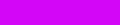

# color-hash

**Generate a color based on a value**

This module generates a color based on an object, by calculating a color value
based on a hash value for the object. This means the result is deterministic:
the same value will always result in the same color (so long as the hash
function remains deterministic).

This module is a port of the [color-hash Javascript library](https://github.com/zenozeng/color-hash).

It supports Python 3.7+ and it has no dependencies.

## Quick Start

```python
>>> from colorhash import ColorHash
>>> c = ColorHash('Hello World')
>>> c.hsl
(131, 0.65, 0.5)
>>> c.rgb
(45, 210, 75)
>>> c.hex
'#2dd24b'
```

## Installation

Its hosted on PyPI.

```bash
pip install colorhash
```

## Advanced usage

You can influence every aspect of final color. **Default values** are following:

```python
ColorHash(
    obj: Any,
    lightness: Sequence[float, ...] = (0.35, 0.5, 0.65),  # picks 'randomly' one
    saturation: Sequence[float, ...] = (0.35, 0.5, 0.65),  # picks 'randomly' one
    min_h: Optional[int] = None,  # hue, min 0
    max_h: Optional[int] = None,  # hue, max 360
)
```

But be careful, **setting tight conditions may result in very similar colors**. See example tables.

You can fix lightness or saturation to single value(s) by using sequence with 1 element (eg. `[0.5]`).

| code                                  | hex       | color                           |
|:--------------------------------------|:---------:|:-------------------------------:|
| `ColorHash('hey')  # default` | `#782d86` |  |
| `ColorHash('hey', lightness=[0.55])` | `#b453c6` |  |
| `ColorHash('hey', lightness=[0.75])` | `#d69fdf` |  |
| `ColorHash('hey', lightness=[0.95])` | `#f7ecf9` |  |
| `ColorHash('hey', saturation=[0.15])` | `#8d6c93` |  |
| `ColorHash('hey', saturation=[0.55])` | `#b139c6` |  |
| `ColorHash('hey', saturation=[0.95])` | `#d406f9` |  |
| `ColorHash('hey', lightness=[0.95], saturation=[0.95])` | `#fbe6fe` |  |
| `ColorHash('oh', lightness=[0.95], saturation=[0.95])` | `#fef0e6` |  |
| `ColorHash('boi', lightness=[0.95], saturation=[0.95])` | `#e6fee7` |  |

You can set hue range or even fix it by setting `min_h` = `max_h`.

| code                                  | hex       | color                           |
|:--------------------------------------|:---------:|:-------------------------------:|
| `ColorHash('hey', min_h=150)` | `#2d5886` |  |
| `ColorHash('hey', min_h=300)` | `#862d6c` |  |
| `ColorHash('hey', max_h=150)` | `#866e2d` |  |
| `ColorHash('hey', min_h=150, max_h=360)` | `#2d5886` |  |
| `ColorHash('hey', min_h=150, max_h=150)  # fixed hue` | `#2d8659` |  |

Or you can let `ColorHash` decide between combination of many `lightness` and `saturation` options (mind `min_h` and `max_h` are equal in this example).

| code                                  | hex       | color                           |
|:--------------------------------------|:---------:|:-------------------------------:|
| `ColorHash('stick', min_h=65, max_h=65, saturation=[x/10 for x in range(1, 10)], lightness=[x/10 for x in range(1, 10)])` | `#869108` |  |
| `ColorHash('with', min_h=65, max_h=65, saturation=[x/10 for x in range(1, 10)], lightness=[x/10 for x in range(1, 10)])` | `#eef5a3` |  |
| `ColorHash('one', min_h=65, max_h=65, saturation=[x/10 for x in range(1, 10)], lightness=[x/10 for x in range(1, 10)])` | `#ddeb47` |  |

Finally some bad examples. When you set too strict rules, colors may be almost identical.

| code                                  | hex       | color                           |
|:--------------------------------------|:---------:|:-------------------------------:|
| `ColorHash('lets', lightness=[0.95], saturation=[0.95], min_h=300)` | `#fee6f8` |  |
| `ColorHash('break', lightness=[0.95], saturation=[0.95], min_h=300)` | `#fee6fb` |  |
| `ColorHash('it', lightness=[0.95], saturation=[0.95], min_h=300)` | `#fee6fa` |  |
| `ColorHash('here', min_h=150, max_h=150)` | `#6ce0a6` |  |
| `ColorHash('goes', min_h=150, max_h=150)` | `#79d2a6` |  |
| `ColorHash('almost', min_h=150, max_h=150)` | `#6ce0a6` |  |
| `ColorHash('same', min_h=150, max_h=150)` | `#79d2a6` |  |
| `ColorHash('color', min_h=150, max_h=150)` | `#6ce0a6` |  |


## Changelog

- color-hash **2.0.0** *(2023-09-22)*
  - ✨ Expose params to influence colors
  - ✨ Runtime validation of input params
  - 📝 Update docs for advanced usage
- color-hash **1.3.2** *(2023-09-21)*
  - ⚡️ 30%+ speedup on `hsl2rgb()`
  - ✅ Add tests for all named colors (1500+ tests)
- color-hash **1.3.1** *(2023-09-21)*
  - 🐛 Handle missing `importlib-metadata` import
- color-hash **1.3.0** *(2023-09-20)*
  - 🧑‍💻 Add `py.typed` to support type annotations (#4)
  - 📦 Changed packaging ecosystem
    - ➖ Remove `poetry`
    - ➖ Remove `tox`
    - ➕ Add `pip-tools` (manage dependencies)
    - ➕ Add `hatch` (build & test)
    - ➕ Add `twine` (publish)
  - ✨ Support `python3.11`
  - ⚰️ Drop support for `python3.6` (downloads from PyPI are under 1%)
- color-hash **1.2.2** *(2022-10-17)*
  - ✨ Add publish helper script
- color-hash **1.2.1** *(2022-10-17)*
  - 📝 Update docs
- color-hash **1.2.0** *(2022-10-17)*
  - 🧑‍💻 Use typing supporting `python3.6`
- color-hash **1.1.0** *(2022-09-01)*
  - ✅ Add tests
  - 🚸 Add installation instructions
- color-hash **1.0.4** *(2021-11-30)*
  - Support only for `python3.6+`
  - ✅ Add tests
- color-hash **1.0.3** *(2020-12-04)*
  - ⚰️ Drop support for `python2.x`
  - 🎉 Handover of project maintenance
- color-hash **1.0.2** *(2016-07-08)*
  - ✨ Add ``crc32_hash`` function and set default hashfunc to that. It's not
    fully backwards-compatible, but I don't want to bump the version a lot for
    not doing my research.
- color-hash **1.0.0** *(2016-07-07)*
  - 🎉 Initial port.

## Speed comparison

Running `pytest` (1600+ tests) on different python versions.

| python | secs    |
| :----: | :-----: |
| 3.7    | `1.252` |
| 3.8    | `1.239` |
| 3.9    | `0.720` |
| 3.10   | `0.690` |
| 3.11   | `0.892` |

## License

Copyright (c) 2016 Felix Krull <f_krull@gmx.de>

This is a port of the 'color-hash' Javascript library which is:

Copyright (c) 2015 Zeno Zeng

Permission is hereby granted, free of charge, to any person obtaining a copy of
this software and associated documentation files (the "Software"), to deal in
the Software without restriction, including without limitation the rights to
use, copy, modify, merge, publish, distribute, sublicense, and/or sell copies of
the Software, and to permit persons to whom the Software is furnished to do so,
subject to the following conditions:

The above copyright notice and this permission notice shall be included in all
copies or substantial portions of the Software.

THE SOFTWARE IS PROVIDED "AS IS", WITHOUT WARRANTY OF ANY KIND, EXPRESS OR
IMPLIED, INCLUDING BUT NOT LIMITED TO THE WARRANTIES OF MERCHANTABILITY, FITNESS
FOR A PARTICULAR PURPOSE AND NONINFRINGEMENT. IN NO EVENT SHALL THE AUTHORS OR
COPYRIGHT HOLDERS BE LIABLE FOR ANY CLAIM, DAMAGES OR OTHER LIABILITY, WHETHER
IN AN ACTION OF CONTRACT, TORT OR OTHERWISE, ARISING FROM, OUT OF OR IN
CONNECTION WITH THE SOFTWARE OR THE USE OR OTHER DEALINGS IN THE SOFTWARE.
